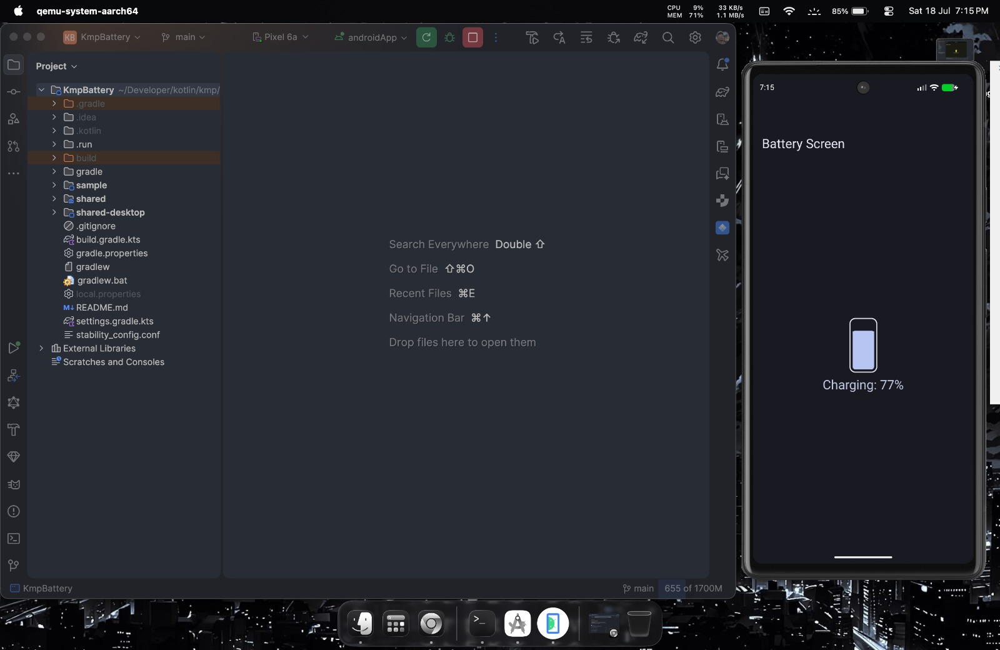
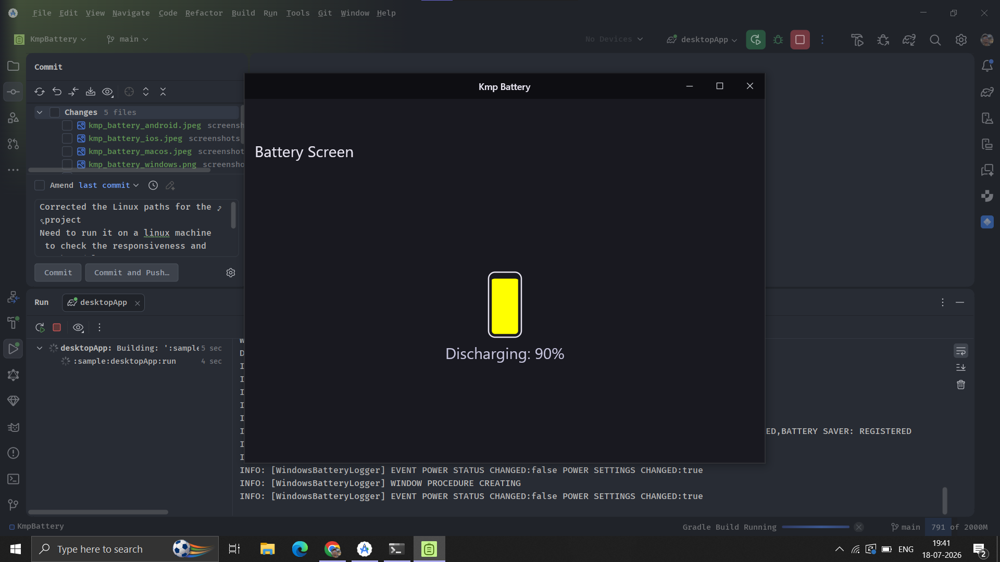
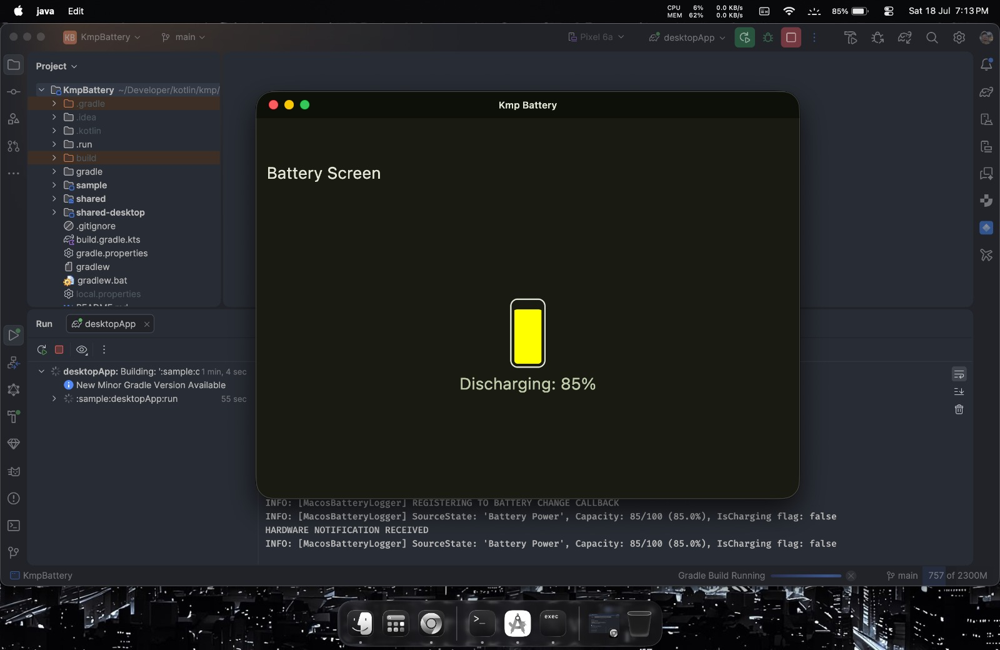
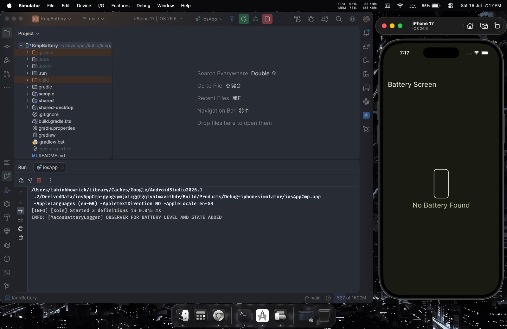

## 🔋 KMP Battery

  
  
  
  

A Kotlin Multiplatform library example demonstrating how to read battery state across different
platforms.

### 📱 Supported Platforms

With KMP we can target various platforms. The table below lists the platforms, their status, and
relevant screenshots:

| Platform | Screenshot                                                                              | Tested? |
|:---------|:----------------------------------------------------------------------------------------|:--------|
| Android  |  | Yes     |
| Windows  |   | Yes     |
| MacOS    |      | Yes     |
| iOS      |          | No      |
| Linux    | N/A                                                                                     | No      |

## 🚀 Features

* **Native Battery Access:** Demonstrates how to bridge platform-specific native APIs to Kotlin.
* **Compose Multiplatform UI:** Shared UI implementation across Android, Desktop, and iOS.
* **Lightweight:** Minimal dependencies, focused on educational content.

## 🛠️ Prerequisites

* **JDK:** Version 17 or higher.
* **Gradle:** The project uses the Gradle Wrapper; no manual Gradle installation is required.
* **OS Requirements:**
    * **macOS:** Required for building iOS targets (with Xcode installed).
    * **Windows/Linux:** Standard environment for Desktop and Android builds.

## 📦 Project Modules

- `androidApp`: An Android application module.
- `composeApp`: Contains shared UI logic for Compose Multiplatform.
- `desktopApp`: A Compose Desktop application module.
- `iosAppCmp`: An iOS application module.
- `terminalApp`: A native terminal application demonstrating battery state access.

## 🤝 Contributing

Contributions are welcome! If you find a bug or have an improvement, please see
the [CONTRIBUTING.md](CONTRIBUTING.md) file for guidelines.

## 📜 License

This project is licensed under the MIT License. Please see the [LICENSE](LICENSE) file for details.

## 🎯 Conclusion

This project serves as a practice ground to explore the powerful features of Kotlin Multiplatform (
KMP). It demonstrates how to interact with platform-specific native APIs from common Kotlin code,
which is a core strength of KMP. Feel free to use this as a reference for your own multiplatform
explorations.